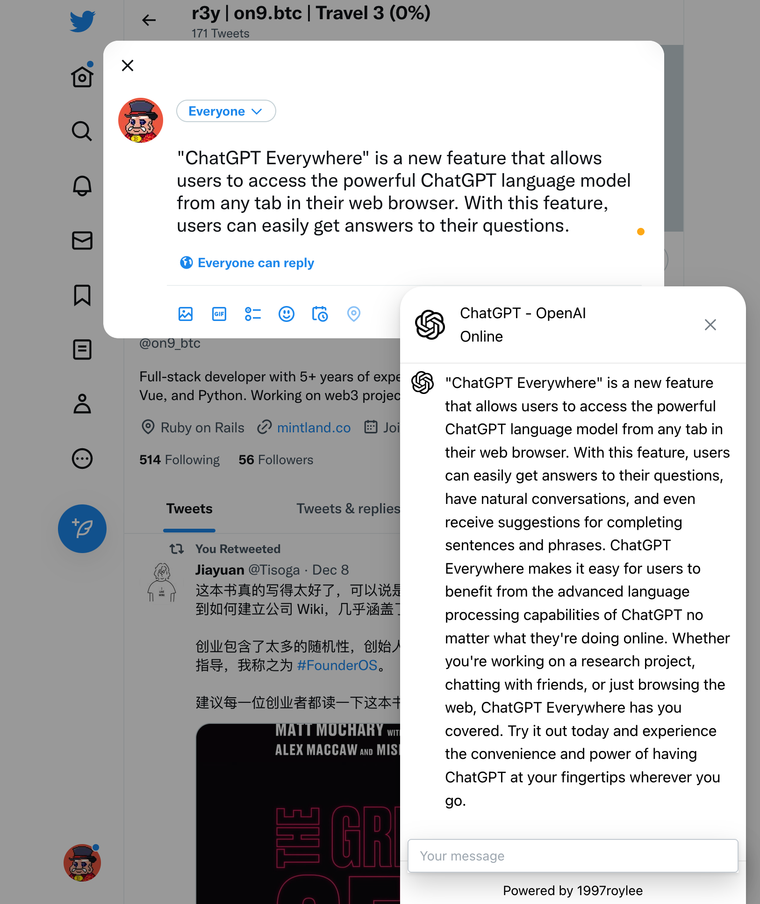

# ChatGPT Everywhere

"ChatGPT Everywhere" is a new extension that allows users to access the powerful ChatGPT language model from any tab in their web browser. With this feature, users can easily get answers to their questions, have natural conversations, and even receive suggestions for completing sentences and phrases. ChatGPT Everywhere makes it easy for users to benefit from the advanced language processing capabilities of ChatGPT no matter what they're doing online. Whether you're working on a research project, chatting with friends, or just browsing the web, ChatGPT Everywhere has you covered. Try it out today and experience the convenience and power of having ChatGPT at your fingertips wherever you go.

## Installation

### Chrome

1. Download the [latest release] from Releases.
2. Unzip the file.
3. Go to `chrome://extensions/` in your browser.
4. Enable `Developer mode` in the top right corner.
5. In the top left corner, click `Load unpacked`.
6. Select the unzipped folder.
7. Enjoy!

### Screenshots

## Credit

This project is inspired by [wong2/chat-gpt-google-extension](https://github.com/wong2/chat-gpt-google-extension)